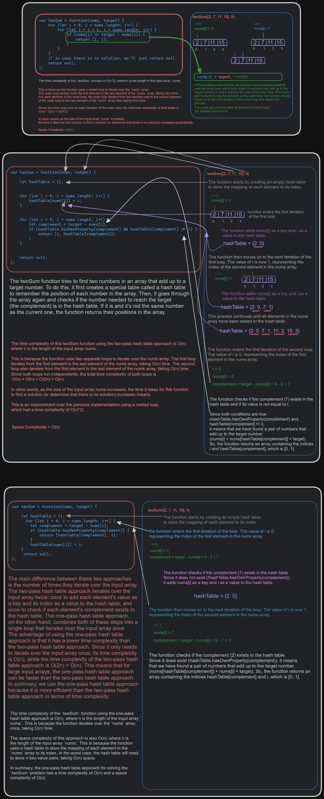

```js
// Define a function that takes an array of numbers and a target number as parameters using an arrow function syntax
const twoSum = (nums, target) => {
  // Loop through the array from the first element to the second last element
  for (let i = 0; i < nums.length - 1; i++) {
    // Loop through the array from the next element to the last element
    for (let j = i + 1; j < nums.length; j++) {
      // Check if the sum of the current element and the next element is equal to the target
      if (nums[i] + nums[j] === target) {
        // If yes, return an array with their indices
        return [i, j];
      }
    }
  }
  // If no pair is found, return an empty array
  return [];
}
```

```js
var twoSum = function(nums, target) {
    // Create a hash table to store the mapping of each element to its index
    let hashTable = {};
    
    // First iteration: add each element's value as a key and its index as a value to the hash table
    for (let i = 0; i < nums.length; i++) {
        hashTable[nums[i]] = i;
    }
    
    // Second iteration: check if each element's complement exists in the hash table
    for (let i = 0; i < nums.length; i++) {
        let complement = target - nums[i];
        if (hashTable.hasOwnProperty(complement) && hashTable[complement] != i) {
            return [i, hashTable[complement]];
        }
    }
    
    // In case there is no solution, we'll just return null
    return null;
};

```

```js
var twoSum = function(nums, target) {
    // Create a hash table to store the mapping of each element to its index
    let hashTable = {};
    
    // Iterate over the nums array
    for (let i = 0; i < nums.length; i++) {
        let complement = target - nums[i];
        if (hashTable.hasOwnProperty(complement)) {
            return [hashTable[complement], i];
        }
        hashTable[nums[i]] = i;
    }
    
    // In case there is no solution, we'll just return null
    return null;
};

```
